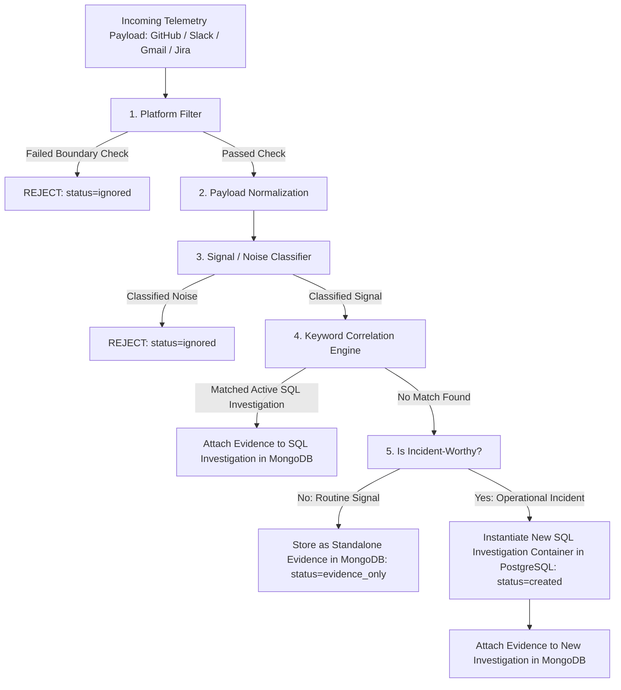

# Operational Intelligence Platform (Sigint AI): Complete Technical Specification & Architecture Blueprint

This document provides a comprehensive, end-to-end technical reference for the **Operational Intelligence Platform (OIP)**. It is authored specifically to allow system architects and technical leads to audit the system, verify implementation details, understand the exact data flows, and review completed capabilities versus pending roadmap items.

---

## 1. System Vision & Core Value Proposition

The **Operational Intelligence Platform (OIP)** is an enterprise-grade, AI-powered incident diagnosis and operational triage assistant. It addresses **alert fatigue** and **context-switching overhead** by:
1. **Multi-Platform Ingestion**: Aggregating raw telemetry from **GitHub**, **Slack**, **Gmail**, and **Jira**.
2. **Deterministic Processing**: Filtering out operational noise and routing valid signals through keyword correlation engines.
3. **Standalone Evidence vs. Incident Containers**: Separating routine observability logs (Evidence in MongoDB) from actionable incident tickets (Investigations in PostgreSQL).
4. **AI Forensics**: Synthesizing chronological evidence feeds using LLM analysis (OpenAI GPT-4o) to produce root cause summaries and remediation plans.
5. **Closed-Loop Operations**: Enabling one-click escalation from the UI directly to Slack triage channels (`POST /share-slack`) and Jira Cloud project boards (`POST /escalate-jira`).

---

## 2. Full Architecture & Ingestion Data Pipeline



### 2.1. Ingestion Pipeline Stages (`app/ingest/services.py`)

#### Stage 1: Platform Boundary Filter (`platform_filter`)
Verifies incoming events against tenant integration configuration settings stored in PostgreSQL (`integration.config`):
* **GitHub**: Validates repository `full_name` against `config.tracked_repos`.
* **Slack**: Validates event channel against `config.channel_id`.
* **Jira**: Validates issue project key against `config.tracked_projects`.
* *Result if rejected*: `{"status": "ignored", "reason": "..."}`

#### Stage 2: Payload Normalization (`normalize_payload`)
Transforms heterogeneous vendor JSON payloads into a standardized internal representation:
* Extracts `type` (`slack`, `github`, `jira`, `gmail`), `summary` (clean title/subject without noisy prefixes), `author_name`, `source_url`, and `metadata`.

#### Stage 3: Deterministic Signal / Noise Classifier (`classify_signal`)
Rule-based, deterministic classifier evaluating configuration parameters. **No LLM is used**:
* **Allowed Senders (`allowed_senders`)**: Checks sender email/username against whitelist (e.g. `["alerts@datadog.com", "sentry.io", "github.com", "pagerduty.com"]`).
* **Required Keywords (`required_keywords`)**: Verifies subject/text contains required operational keywords (`["critical", "incident", "error", "failed", "outage"]`).
* **Subject Filters (`subject_filters`)**: Evaluates subject substrings.
* **Trivial Content Filter**: Drops empty or placeholder messages.
* *Result if classified as noise*: `{"status": "ignored", "reason": "..."}`

#### Stage 4: Token Correlation Engine (`correlate_signal`)
Tokenizes text using regex (`re.findall(r'\b[a-zA-Z]{3,}\b')`), filters out stop-words, and computes set intersection overlap against all active SQL `Investigation` containers (`status in ('open', 'investigating')`) for the active tenant:
* *Match Found*: Attaches evidence log to existing investigation container in MongoDB. Returns `{"status": "correlated", "investigation_id": ...}`.

#### Stage 5: Incident-Worthiness Evaluation & Storage Routing (`is_incident_worthy`)
When correlation fails to match an existing open investigation, the signal is evaluated for incident-worthiness:
* **Incident-Worthy Criteria**: Summary or metadata contains high-impact operational keywords (`critical`, `outage`, `error`, `failed`, `spiked`, `leak`, `exception`, `down`, `breach`, `emergency`, `timeout`, `panic`) or high/critical priority metadata tags.
* *If NOT Incident-Worthy*: Saved as **Standalone Evidence Only** in MongoDB (`investigation_id = null`). **Zero SQL database pollution**. Returns `{"status": "evidence_only"}`.
* *If Incident-Worthy*: Instantiates a new PostgreSQL `Investigation` container with auto-computed severity (`critical`, `high`, `medium`), and attaches the evidence log in MongoDB. Returns `{"status": "created", "investigation_id": ...}`.

---

## 3. Dual Polyglot Database Architecture & Test Isolation

The platform uses a hybrid storage model to handle relational tenant data and high-volume unstructured telemetry separately.

```
                  ┌───────────────────────────────────────────┐
                  │           FastAPI Backend Core            │
                  └─────────────────────┬─────────────────────┘
                                        │
           ┌────────────────────────────┴────────────────────────────┐
           ▼                                                         ▼
┌──────────────────────────────┐                         ┌──────────────────────────────┐
│  PostgreSQL (Relational SQL) │                         │   MongoDB (Document Store)   │
│  - Users & Organizations     │                         │   - evidence collection      │
│  - Memberships & RBAC Roles  │                         │   - Unstructured JSON logs    │
│  - Integration Secrets (Enc) │                         │   - Linked & Standalone Logs │
│  - Investigation Containers  │                         └──────────────────────────────┘
│  - AI Diagnostic Reports     │
└──────────────────────────────┘
```

### 3.1. Relational Database Schema (PostgreSQL)

* **`users`**: User profiles (`id`, `email`, `password_hash`, `is_active`, `is_verified`, `created_at`).
* **`organizations`**: Multi-tenant boundaries (`id`, `name`, `slug`, `created_at`).
* **`memberships`**: RBAC user-to-org mappings (`id`, `user_id`, `organization_id`, `role` in `owner`, `admin`, `member`, `viewer`).
* **`integrations`**: Platform credentials and rules (`id`, `organization_id`, `platform`, `credentials_encrypted` via Fernet, `config` JSONB, `status`).
* **`investigations`**: Active incident containers (`id`, `organization_id`, `title`, `description`, `severity`, `status`, `assigned_to_id`, `suggestion_action`, `detected_at`).
* **`diagnoses`**: Persisted LLM reports (`id`, `investigation_id`, `triggered_by_id`, `report_summary`, `created_at`).

### 3.2. Document Database Schema (MongoDB `evidence` collection)

```json
{
  "_id": "uuid-string-primary-key",
  "investigation_id": "investigation-uuid-string-or-null",
  "type": "gmail | slack | github | jira | alert",
  "summary": "String title or commit message summary",
  "author_name": "Author / Bot Sender Name",
  "source_url": "HTTPS deep link to commit / ticket / message",
  "metadata": {
    "email": { "id": "...", "subject": "...", "from": "...", "snippet": "..." },
    "commit_sha": "...",
    "raw_headers": {}
  },
  "created_at": "ISODate timestamp (UTC)"
}
```

### 3.3. Database Test Isolation Setup

To ensure unit testing never wipes development or production data:

| Environment | PostgreSQL Database | MongoDB Database |
| :--- | :--- | :--- |
| **Development** | `oip_db` | `oip_mongo` |
| **Automated Testing (Pytest)** | `oip_db_test` | `oip_mongo_test` |

* **PostgreSQL Isolation**: Pytest uses transactional isolation (`conftest.py`), creating `oip_db_test` and rolling back transactions per test.
* **MongoDB Isolation**: Setting `settings.ENVIRONMENT = "testing"` in `conftest.py` causes `get_mongo_db()` in `app/db/mongo.py` to route all Motor client calls to `oip_mongo_test`. Your development database (`oip_mongo`) is **100% safe and untouched** during test runs.

---

## 4. Integration Connectors & Background Sync

### 4.1. GitHub Integration
* **Ingest Route**: `POST /api/v1/integrations/github/webhook`.
* **Payload Parsing**: Extracts head commit messages, author username/name, and commit URL. Enforces `tracked_repos` filter.

### 4.2. Slack Integration
* **Ingest Route**: `POST /api/v1/integrations/slack/webhook`.
* **OAuth 2.0**: Redirect & token exchange endpoints (`/authorize`, `/callback`).
* **Closed-Loop Action**: `POST /api/v1/investigations/{id}/share-slack` decrypts bot token, formats Slack Markdown alert block, and posts to configured triage channel via `chat.postMessage`.

### 4.3. Gmail Integration & Background Worker (`gmail_worker.py`)
* **OAuth 2.0**: Consent consent flow with offline refresh token support.
* **Background Worker**: `start_gmail_polling_worker()` runs continuously inside FastAPI lifespan lifecycle.
* **Token Auto-Refresh**: If Google API returns `401 Unauthorized`, automatically exchanges `refresh_token` for a new `access_token` at `https://oauth2.googleapis.com/token`, saves updated encrypted credentials to SQL, and retries email fetch.
* **Polling Query**: Polling parameters support `search_query`, `allowed_senders`, `required_keywords`, and `last_checked_time`.

### 4.4. Jira Software Integration
* **Basic Auth Connector**: `POST /api/v1/integrations/jira/connect` validates credentials against Jira Cloud API `/rest/api/3/myself` using `auth=(email, api_token)`.
* **Closed-Loop Action**: `POST /api/v1/investigations/{id}/escalate-jira` formats Atlassian Document Format (ADF) JSON payloads, creates Task issues on Jira Cloud (`POST /rest/api/3/issue`), appends ticket keys (`PROD-404`) to `investigation.suggestion_action`, and returns `/browse/KEY` links.

---

## 5. AI Forensic Diagnosis Engine (`DiagnosisService`)

* **Endpoint**: `POST /api/v1/investigations/{id}/diagnose`.
* **Process**:
  1. Fetches all evidence chronologically from MongoDB for the investigation ID.
  2. Formats a operational system prompt + chronological evidence timeline context.
  3. Queries OpenAI API (`AsyncOpenAI`, model `gpt-4o`, `temperature=0.2`, `max_tokens=500`).
  4. Saves `Diagnosis` row in PostgreSQL and updates `investigation.status = "investigating"` and `investigation.suggestion_action`.
  5. Includes a local heuristic fallback diagnosis generator if OpenAI API keys are unconfigured or fail.

---

## 6. Frontend Operations UI Structure

Built with React 18, Vite, Tailwind CSS, TanStack Query, and Zustand following Linear/Palantir light-mode design tokens:

* **Attention Deck Dashboard (`/dashboard`)**: Displays active critical investigation cards, risk severity badges, assignees, and real-time **Active Signal Stream** polling `GET /evidence/recent`.
* **Integrations Hub (`/integrations`)**: Config cards for GitHub, Slack, Gmail, Jira with 1-click OAuth, Basic Auth credential forms, and filter drawers.
* **Investigation Details (`/investigations/:id`)**:
  * Multi-pane view with container scrolling (`overflow-y-auto min-h-0`).
  * **Left Pane**: Root Cause summary, Suggested Remediation, **Share to Slack** (brand purple `#4A154B`) & **Escalate to Jira** (brand blue `#0052CC`) buttons, live terminal logs.
  * **Center Pane**: Multi-platform Evidence Feed timeline showing platform badges, author pills, and source links.
  * **Right Pane**: Entity references and interactive audit comment stream.

---

## 7. Complete Implementation Matrix: What Works vs. Roadmap

### ✅ **WHAT IS 100% WORKING & VERIFIED**
* [x] Multi-tenant user authentication, organization management, and RBAC membership scoping.
* [x] Fernet symmetric encryption for integration OAuth & API tokens.
* [x] 5-Stage rule-based Ingestion Pipeline (`platform_filter` ➔ `normalize_payload` ➔ `classify_signal` ➔ `correlate_signal` ➔ `is_incident_worthy`).
* [x] Rule-based Signal/Noise classification (`allowed_senders`, `required_keywords`, `subject_filters`).
* [x] Standalone evidence storage in MongoDB (`investigation_id = null`) to eliminate SQL table pollution.
* [x] GitHub, Slack, Gmail, and Jira integrations (OAuth 2.0 & Basic Auth).
* [x] Continuous background Gmail worker loop with automatic OAuth token refresh on 401.
* [x] AI Forensic Diagnosis Engine (GPT-4o + fallback).
* [x] Closed-loop operations: **Share to Slack** & **Escalate to Jira**.
* [x] Dual-database test isolation (`oip_db_test` PostgreSQL + `oip_mongo_test` MongoDB).
* [x] Attention Deck Dashboard, Signal Stream, Integrations Hub, Investigation Details multi-pane UI with scroll containers.
* [x] **46 Passing Pytest Integration Tests**.

### ⏳ **WHAT REMAINS TO BE IMPLEMENTED (From Master `PLAN.md`)**
* [ ] **Global Command Palette (`⌘K`)**: Centered search modal for rapid navigation across investigations, entities, and actions.
* [ ] **Dynamic Entity Details Hub (`/entities/:type/:id`)**: Aggregate summary pages for specific Customers (e.g. `TechCorp`), Services (e.g. `Auth Gateway`), Teams, or Projects.
* [ ] **Notion Integration Connector & Evidence Cards**: Connecting Notion workspaces and rendering doc cards inside Evidence Feeds.
* [ ] **Automated Executive Reports & Postmortems (`/reports`)**: Generating downloadable PDF/Markdown postmortem summaries for leadership.
* [ ] **Sidebar Workspace Switcher UI**: Workspace org selection dropdown inside the sidebar navigation.

---

*This specification document is up to date and reflects the exact state of the codebase.*
