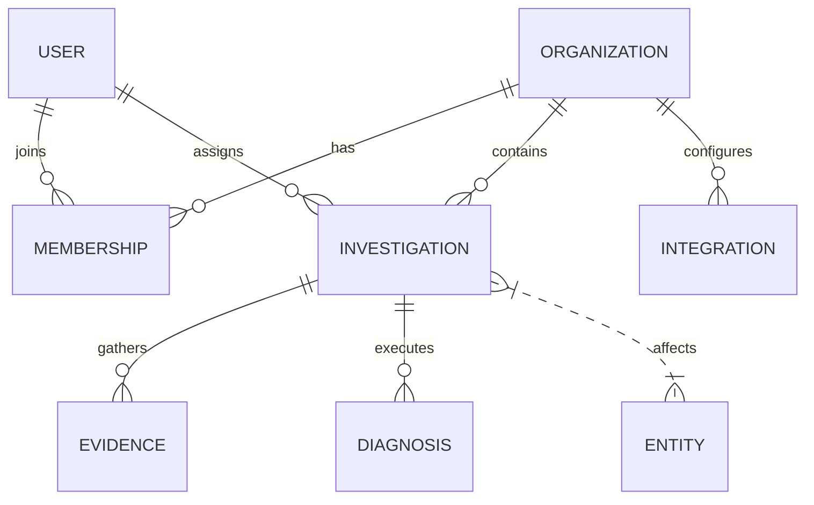
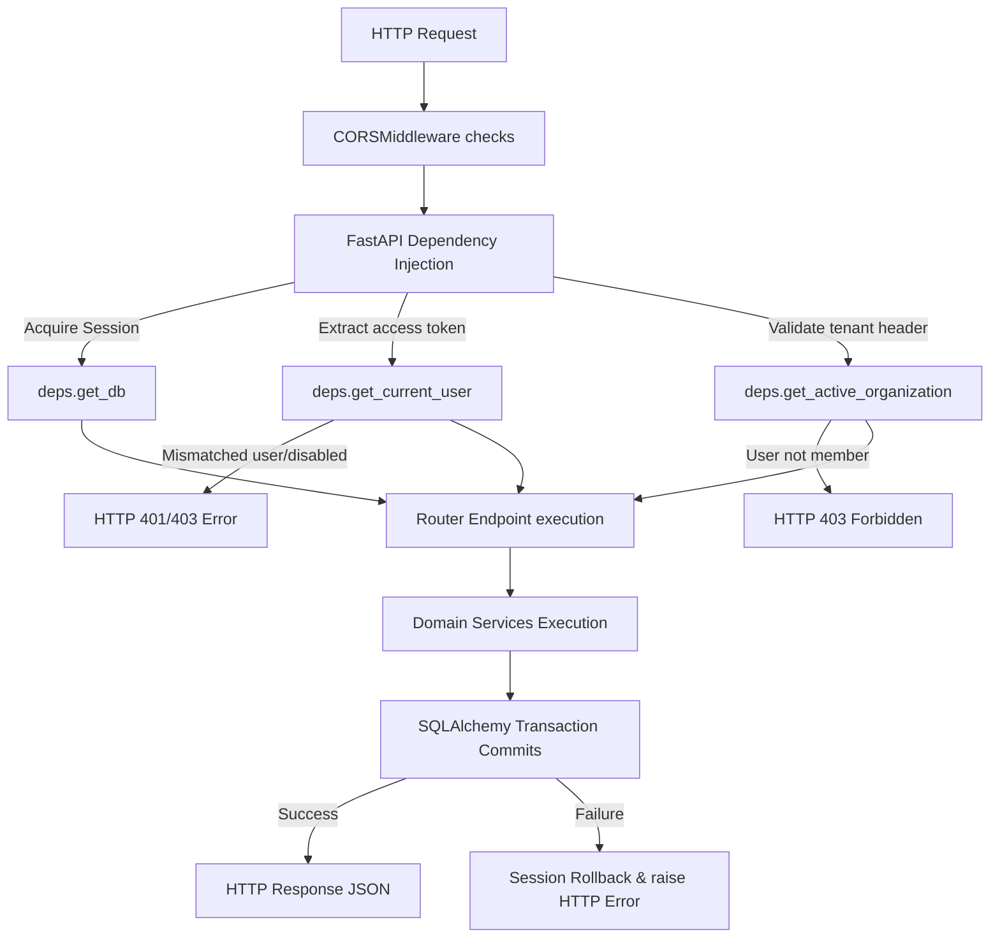
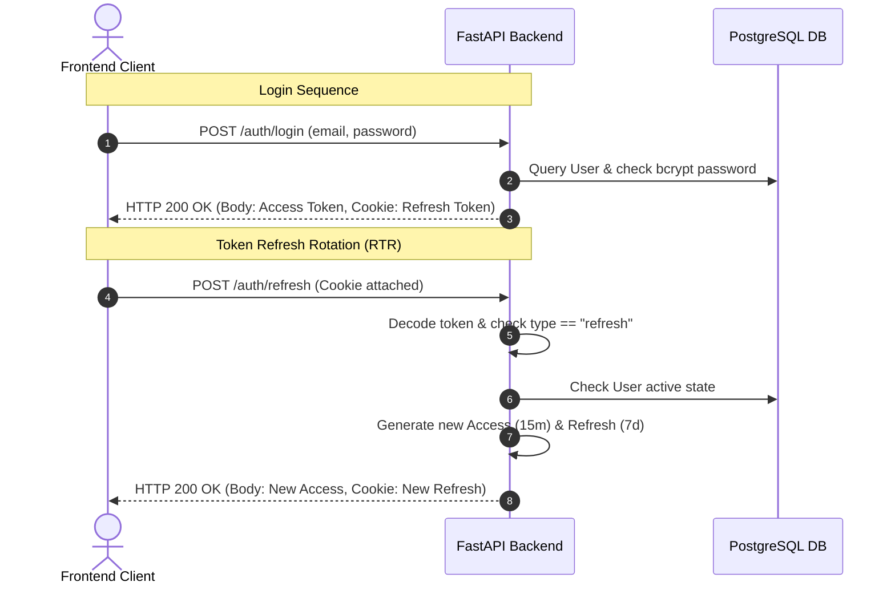

# System Architecture Specification

This document serves as the unified technical specification and architectural blueprint for the **Operational Intelligence Platform (OIP)**.

---

## 1. Product Overview

OIP solves the critical problem of **alert fatigue** and **context-switching tax** for engineering, SecOps, and operations teams. During production incidents, diagnostic information is scattered across Slack threads, Jira tickets, GitHub PRs, and live log streams. 

The platform aggregates these multi-platform signals into single, cohesive **Investigations**, maps them to affected **Entities** (Customers, Services, Teams, Projects), and runs structured LLM prompts to propose immediate **Remediations** (e.g., scaling deployments or rolling back configuration changes) to protect SLA agreements and contract values.

---

## 2. Domain Model & Entities

The target relational domain model is structured to enforce strict tenant isolation and modular domain expansion:

### 2.1. Core Entities Definition

#### A. User
*   **Purpose:** Authenticated administrator and responder accounts.
*   **Key Fields:** `id` (UUID), `email` (Unique, Indexed), `password_hash`, `is_active`, `is_verified`, `created_at`, `updated_at`.
*   **Relationships:** Many-to-Many with `Organization` (via `Membership`), One-to-Many with `Investigation`.

#### B. Organization
*   **Purpose:** The tenant boundary. All resource access is restricted inside this scope.
*   **Key Fields:** `id` (UUID), `name`, `slug` (Unique, Indexed), `created_at`.
*   **Relationships:** One-to-Many with `Membership`, `Investigation`, and `Integration`.

#### C. Membership
*   **Purpose:** Maps users to organizations, defining RBAC scopes.
*   **Key Fields:** `id` (UUID), `user_id` (FK), `organization_id` (FK), `role` (Enum/String: owner, admin, member, viewer).
*   **Relationships:** Joint link between `User` and `Organization`.

#### D. Investigation
*   **Purpose:** Incident containers displayed on the Attention Deck.
*   **Key Fields:** `id` (UUID), `organization_id` (FK), `title`, `description`, `severity` (Enum), `status` (Enum), `assigned_to` (FK User), `suggested_action` (Text), `detected_at`.
*   **Relationships:** Belongs to `Organization`. One-to-Many with `Evidence` and `Diagnosis`.

#### E. Evidence
*   **Purpose:** Chronological feed items associated with an investigation.
*   **Key Fields:** `id` (UUID), `investigation_id` (FK), `type` (Enum: slack, github, jira, etc.), `summary`, `metadata` (`JSONB` for nested unstructured logs), `created_at`.
*   **Relationships:** Belongs to `Investigation`.

#### F. Integration
*   **Purpose:** Configurations for connecting external systems.
*   **Key Fields:** `id` (UUID), `organization_id` (FK), `platform` (Enum), `credentials_encrypted` (Encrypted JSONB), `status`, `last_synced_at`.
*   **Relationships:** Belongs to `Organization`.

#### G. Diagnosis
*   **Purpose:** Single-prompt LLM execution logs.
*   **Key Fields:** `id` (UUID), `investigation_id` (FK), `triggered_by_id` (FK User), `report_summary` (Text), `created_at`.
*   **Relationships:** Belongs to `Investigation`.

---

## 3. Database Design

### 3.1. Database Tables Column Specifications

#### Table: `users`
*   `id`: `UUID` (PK, Indexed)
*   `email`: `VARCHAR(255)` (Unique, Indexed, Not Null)
*   `password_hash`: `VARCHAR(255)` (Not Null)
*   `first_name`: `VARCHAR(100)` (Nullable)
*   `last_name`: `VARCHAR(100)` (Nullable)
*   `is_active`: `BOOLEAN` (Default: `true`)
*   `is_verified`: `BOOLEAN` (Default: `false`)
*   `created_at`: `TIMESTAMPTZ` (Server Default: `now()`)
*   `updated_at`: `TIMESTAMPTZ` (Server Default: `now()`, Auto-update)

#### Table: `organizations`
*   `id`: `UUID` (PK, Indexed)
*   `name`: `VARCHAR(100)` (Not Null)
*   `slug`: `VARCHAR(100)` (Unique, Indexed, Not Null)
*   `created_at`: `TIMESTAMPTZ` (Server Default: `now()`)

#### Table: `memberships`
*   `id`: `UUID` (PK, Indexed)
*   `user_id`: `UUID` (FK `users.id`, Index, Cascade Delete)
*   `organization_id`: `UUID` (FK `organizations.id`, Index, Cascade Delete)
*   `role`: `VARCHAR(50)` (Default: `"member"`)
*   `created_at`: `TIMESTAMPTZ` (Server Default: `now()`)

---

## 4. Request Lifecycle

The flow diagram below shows how FastAPI interceptors, dependency injections, and database contexts process incoming HTTP requests:

*   **Dependency injection (`deps.py`):**
    *   `DBSessionDep` retrieves and releases a PostgreSQL connection from the async pool.
    *   `CurrentUserDep` decodes the Bearer token, checks token type (must be `access`), and queries the database to verify the user account is active.
    *   `ActiveOrganizationDep` extracts the `X-Organization-ID` HTTP header, parses it, and checks if a matching `Membership` row links the current user to that organization, enforcing tenant-isolation boundaries.

---

## 5. Authentication Architecture

OIP utilizes **Stateless Access Tokens** combined with **Refresh Token Rotation (RTR)** to deliver secure authentication without database overhead on every request.

### 5.1. Token exchange lifecycle

*   **Access Token (JWT):** Expires in 15 minutes. Delivered in the JSON response body. The client stores it in memory (never in localStorage) to mitigate XSS extraction risks.
*   **Refresh Token (JWT):** Expires in 7 days. Delivered in an `HttpOnly`, `SameSite=Lax`, and `Secure` (production only) cookie. Client scripts cannot read this cookie.
*   **Refresh Token Rotation:** Exchanging a refresh token generates a new access token *and* a newly rotated refresh token, immediately overwriting the old cookie. This protects the session from token replay attacks.

---

## 6. Planned Backend Modules

As mapped in the MVP boundary specifications, the project implements five core domain modules:

1.  **Authentication (`auth`):** Core user registrations, hashes, and session cookies.
2.  **Tenancy (`organizations`):** Isolated workspace management, user membership maps, and RBAC boundary dependencies.
3.  **Investigations (`investigations`):** Incident logs, assignee parameters, severity categories, and statuses.
4.  **Evidence (`evidence`):** Appends system context (Slack logs, Git commits) stored in nested Postgres `JSONB` parameters.
5.  **Diagnosis Engine (`diagnosis`):** Compiles evidence feeds, constructs a single prompt template, and triggers a structured LLM call to propose remediations.

---

## 7. Architecture Decisions & Gap Analysis

To keep implementation efficient and maintainable for a solo developer portfolio scale, the following architectural choices and gap evaluations have been established:

| Concept | Classification | MVP Decision & Alternative |
| :--- | :--- | :--- |
| **Signal** | **Unnecessary Complexity** | Exclude. Storing raw incoming webhook payloads in a separate database table adds an extra write step and schema overhead. Webhook endpoints will parse payloads and write directly as `Evidence` records. |
| **Entity** | **Useful Later** | Postpone. Full relational mapping for Customers, Services, Projects, and Teams is deferred. These are represented as metadata fields or simple string tags on `Investigation` and `Evidence` tables. |
| **Correlation Engine** | **Useful Later** | Postpone. Replace standalone correlation engines with simple, inline SQLAlchemy queries checking for open investigations under the same organization within a specified time window. |
| **MongoDB** | **Unnecessary Complexity** | Exclude. Do not run a second database. PostgreSQL natively supports binary-serialized, indexable `JSONB` columns, which are perfect for unstructured payloads (Slack history dumps, Git diffs). |
| **RabbitMQ** | **Unnecessary Complexity** | Exclude. Event queue managers cell structures require complex retry logic and container setup. Low web traffic scales nicely using FastAPI's standard async loops or standard `BackgroundTasks`. |
| **Redis** | **Useful Later** | Postpone. Short access token lifespans (15 mins) and clearing cookies on logout is sufficient. Invalidation lists are deferred to post-MVP development. |
| **Kafka** | **Unnecessary Complexity** | Exclude. Event streaming at scale is unnecessary and adds extreme JVM container resource overhead. |
| **Multi-Agent System** | **Unnecessary Complexity** | Exclude. Frameworks like CrewAI or LangChain are non-deterministic, slow, and expensive. Replace with a single structured LLM prompt (with JSON Mode or Pydantic output validation) that acts on compiled evidence context. |
