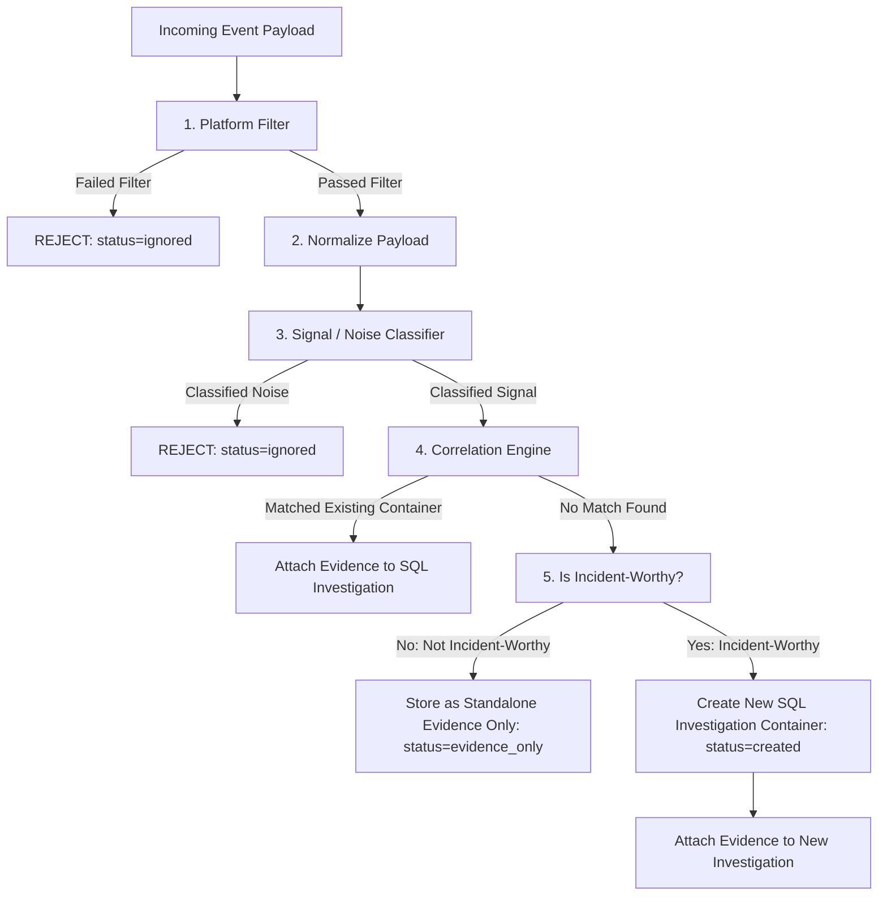

# Operational Intelligence Platform: System Architecture

This document serves as the unified technical specification and architectural blueprint for the **Operational Intelligence Platform (OIP)**.

---

## 1. Product Overview

OIP solves the critical problem of **alert fatigue** and **context-switching tax** for engineering, SecOps, and operations teams. During production incidents, diagnostic information is scattered across Slack threads, Jira tickets, GitHub PRs, and live log streams. 

The platform aggregates these multi-platform signals into single, cohesive **Investigations**, maps them to affected **Entities** (Customers, Services, Teams, Projects), and runs structured LLM prompts to propose immediate **Remediations** (e.g., scaling deployments or rolling back configuration changes) to protect SLA agreements and contract values.

---

## 2. Conceptual Domain Distinctions

A core architectural principle of OIP is the strict separation between telemetry data types across the processing pipeline:

```
[ Incoming Event ] ──► [ Evidence Document ] ──► [ Investigation Container ]
(Raw Payload)          (Normalized Telemetry)     (Active Incident Ticket)
```

### 2.1. Incoming Events
* **Definition**: Raw, unparsed payloads received via webhooks (GitHub, Slack, Jira) or retrieved via background polling (Gmail).
* **Lifespan**: Transient. Passed in-memory into the ingestion pipeline.
* **Storage**: Not persisted in relational SQL tables.

### 2.2. Evidence
* **Definition**: Normalized, structured telemetry documents representing operational logs, commit events, customer emails, Slack messages, or Jira tickets.
* **Storage Layer**: Persisted in **MongoDB** (`evidence` collection).
* **Relationships**: Can be attached to a specific `investigation_id` OR stored as **Standalone Evidence** (`investigation_id = null`).
* **Key Principle**: Storing evidence does **NOT** automatically create an incident. Evidence represents observability data.

### 2.3. Investigations
* **Definition**: Operational incident containers representing high-priority, actionable system issues requiring human triage or automated AI diagnosis.
* **Storage Layer**: Persisted in **PostgreSQL** (`investigations` table).
* **Creation Policy**: Created **ONLY** when an incoming event signal is evaluated as **incident-worthy** and cannot be correlated with an existing open investigation.

---

## 3. Ingestion Pipeline & Event Flow

The ingestion pipeline (`app/ingest/services.py`) is structured into five distinct, single-responsibility stages:



### Stage 1: Platform Filter (`platform_filter`)
Validates basic integration boundary rules stored in PostgreSQL (`integration.config`):
* **GitHub**: Checks if the repository is in `tracked_repos`.
* **Slack**: Checks if the message channel matches `channel_id`.
* **Jira**: Checks if the issue project is in `tracked_projects`.
* *Failure Result*: `{"status": "ignored", "reason": "..."}`

### Stage 2: Payload Normalization (`normalize_payload`)
Standardizes platform-specific JSON payloads into a unified internal representation (`type`, `summary`, `author_name`, `source_url`, `metadata`).

### Stage 3: Deterministic Signal / Noise Classifier (`classify_signal`)
Rule-based classifier that evaluates integration configuration rules. **No LLM is used**:
* **Allowed Senders**: Checks if the sender email/user matches `config.allowed_senders`.
* **Required Keywords**: Verifies that the summary or metadata contains at least one keyword from `config.required_keywords`.
* **Subject Filters**: Checks subject substrings against `config.subject_filters`.
* **Trivial Content Filter**: Rejects empty or placeholder messages.
* *Failure Result*: `{"status": "ignored", "reason": "..."}`

### Stage 4: Correlation Engine (`correlate_signal`)
Tokenizes the normalized summary into keywords and computes set overlap against all active SQL `Investigation` containers (`status in ('open', 'investigating')`) for the active organization:
* *Match Found*: Attaches the evidence document directly to the matched `Investigation` container in MongoDB. Returns `{"status": "correlated", "investigation_id": ...}`.

### Stage 5: Incident-Worthiness Evaluation (`is_incident_worthy`)
If correlation fails to find an existing open investigation, the signal is evaluated for incident-worthiness using rule-based criteria:
* **Incident-Worthy Criteria**: Summary or metadata contains high-impact operational keywords (`critical`, `outage`, `error`, `failed`, `spiked`, `leak`, `exception`, `down`, `breach`, `timeout`) or high/critical metadata severity tags.
* *If NOT Incident-Worthy*: The signal is saved as **Standalone Evidence Only** in MongoDB (`investigation_id = null`). No row is added to PostgreSQL. Returns `{"status": "evidence_only"}`.
* *If Incident-Worthy*: Instantiates a new `Investigation` row in PostgreSQL with heuristic severity (`critical`, `high`, `medium`), and attaches the evidence log. Returns `{"status": "created", "investigation_id": ...}`.

---

## 4. Polyglot Database Design (PostgreSQL + MongoDB)

### 4.1. PostgreSQL Relational Tables
* `users`: User profiles and password hashes.
* `organizations`: Tenant isolation boundary.
* `memberships`: User-to-organization RBAC roles.
* `integrations`: Integration OAuth/Basic Auth tokens (Fernet encrypted) and configuration JSONB rules.
* `investigations`: Incident containers for actionable incidents.
* `diagnoses`: Persisted LLM forensic diagnostic reports.

### 4.2. MongoDB Evidence Collection (`evidence`)
* `_id`: String UUID primary key.
* `investigation_id`: String UUID (or `null` for standalone evidence).
* `type`: Platform type (`slack`, `github`, `gmail`, `jira`, `alert`).
* `summary`: Human-readable event summary.
* `author_name`: Author or bot name.
* `source_url`: Deep link to source event.
* `metadata`: Raw JSON metadata payload.
* `created_at`: UTC timestamp.
