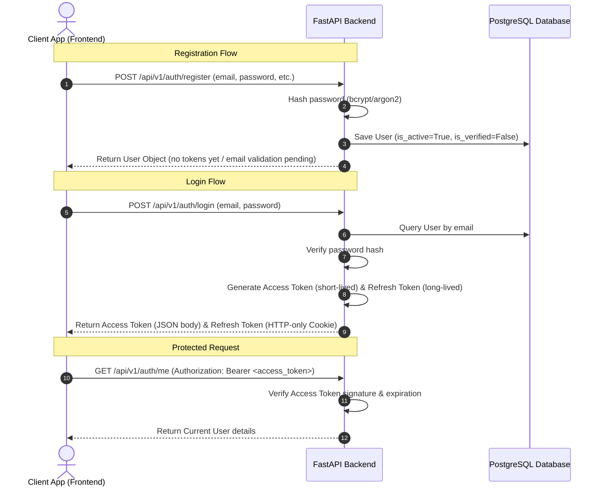

# Authentication Design Document

This document outlines the security architecture, token exchange lifecycle, and future scalability considerations for the authentication system of the **Operational Intelligence Platform (OIP)**.

---

## 1. Authentication Flow

OIP utilizes a stateless, token-based authentication flow employing JSON Web Tokens (JWT). 

### Flow Steps:
1. **Registration:** Frontend sends payload to `/api/v1/auth/register`. The backend performs validation, hashes the password, persists the user entity, and returns a sanitized user model.
2. **Authentication:** Frontend authenticates via `/api/v1/auth/login`. On verification, the backend issues two tokens:
   - **Access Token:** Placed in the JSON response body.
   - **Refresh Token:** Placed in an `HttpOnly`, `Secure`, `SameSite=Lax/Strict` cookie.
3. **Authorization:** Subsequent API requests attach the Access Token inside the `Authorization: Bearer <token>` header.

---

## 2. Refresh Token Strategy

To balance security and user experience:
* **Token Lifespans:**
  - **Access Token:** 15 minutes.
  - **Refresh Token:** 7 days.
* **Storage:**
  - The client stores the Access Token in memory (not localStorage) to prevent Cross-Site Scripting (XSS) extraction.
  - The Refresh Token is stored as an `HttpOnly`, `Secure` cookie, rendering it inaccessible to client-side scripts.
* **Token Rotation (optional but recommended for production):**
  - Upon utilizing a Refresh Token to fetch a new Access Token, the old Refresh Token is invalidated, and a new one is issued (Refresh Token Rotation).
  - This guards against replay attacks. In an empty/stateless setup, we will initially record refresh token IDs (jti) or simply rely on database-managed active sessions to track validity.
* **Revocation / Logout:**
  - Frontend triggers `/api/v1/auth/logout`.
  - Backend clears the Refresh Token cookie (`Max-Age=0`).
  - *Note on stateless invalidation:* For stateless logouts, a Redis blocklist for active Access Tokens is planned. In Phase 1, we will document this architecture and clear the cookies on logout.

---

## 3. Security Considerations

* **Password Hashing:** Passwords will be hashed using `bcrypt` or `argon2id` with a high work factor/salt. Plaintext passwords never touch the DB or logs.
* **Cross-Site Scripting (XSS):** Mitigation is achieved by storing the Refresh Token in an `HttpOnly` cookie.
* **Cross-Site Request Forgery (CSRF):** Since the Access Token is passed in the headers via Bearer scheme (which browsers do not auto-send), APIs requiring it are immune to CSRF. For refresh requests utilizing the cookie, we ensure `SameSite=Lax` or `SameSite=Strict`.
* **Token Claims:** JWT payloads will contain:
  - `sub`: User ID
  - `exp`: Expiration time
  - `type`: Token category (`access` vs `refresh`)
  - `jti`: Unique token identifier (prepared for invalidation tracking)

---

## 4. Future Role-Based Access Control (RBAC) Considerations

To prepare for RBAC without implementing the code:
* The user model will include a conceptual hook for roles (e.g., a role association or list of permissions).
* Token payloads can optionally include the current active role (e.g., `role: "admin"` or `role: "viewer"`) to avoid db lookups on basic permission checks.
* Decorators/Dependencies in FastAPI (such as `RoleChecker(["admin", "manager"])`) will be scoped in design to inspect the current user object before executing request handlers.

---

## 5. Future Multi-Tenancy (Organizations) Considerations

To lay the foundation for multi-tenancy:
* The database schema expects a many-to-many or one-to-many relationship between `Users` and `Organizations`.
* We will establish an optional `current_organization_id` on the context and token claims.
* Request context utilities will resolve organization boundaries by inspecting headers (e.g., `X-Organization-ID`) or checking the database for association validity.
